## UCB-Project1 - Impact of Real Estate Prices on Homelessness

Group 1 - Angela, Jagatha, Lei and Weiming


```python
# import modules
import csv
import pandas as pd
import os
import matplotlib
import matplotlib.pyplot as plt
import numpy as np
from scipy.stats import linregress 
import seaborn as sns 
from scipy import stats
```


```python
# read csv file
file_path1 = os.path.join('HUD_Cities_Data.csv')
file_path2 = os.path.join('zillow_data','18_zillow_selected_cities.csv')
file_path3 = os.path.join('HUD_Consol_Data.csv')
# place csv data into a DataFrame
hud_city_df = pd.read_csv(file_path1)
zillow_df = pd.read_csv(file_path2)
hud_consol_df = pd.read_csv(file_path3)
```

## HUD Data


```python
hud_consol_df.head()
```


<div>
<style scoped>
    .dataframe tbody tr th:only-of-type {
        vertical-align: middle;
    }

    .dataframe tbody tr th {
        vertical-align: top;
    }

    .dataframe thead th {
        text-align: right;
    }
</style>
<table border="1" class="dataframe">
  <thead>
    <tr style="text-align: right;">
      <th></th>
      <th>Year</th>
      <th>CityState</th>
      <th>State</th>
      <th>County</th>
      <th>Total Homeless</th>
      <th>Sheltered Homeless</th>
      <th>Unsheltered Homeless</th>
      <th>Homeless Individuals</th>
      <th>Sheltered Homeless Individuals</th>
      <th>Unsheltered Homeless Individuals</th>
      <th>Homeless People in Families</th>
      <th>Sheltered Homeless People in Families</th>
      <th>Unsheltered Homeless People in Families</th>
      <th>Chronically Homeless Individuals</th>
      <th>Sheltered Chronically Homeless Individuals</th>
      <th>Unsheltered Chronically Homeless Individuals</th>
    </tr>
  </thead>
  <tbody>
    <tr>
      <th>0</th>
      <td>2017</td>
      <td>Anchorage, AK</td>
      <td>AK</td>
      <td>Anchorage</td>
      <td>1128</td>
      <td>973</td>
      <td>155</td>
      <td>848</td>
      <td>693</td>
      <td>155</td>
      <td>280</td>
      <td>280</td>
      <td>0</td>
      <td>114</td>
      <td>70</td>
      <td>44</td>
    </tr>
    <tr>
      <th>1</th>
      <td>2017</td>
      <td>Alaska, AK</td>
      <td>AK</td>
      <td>Alaska</td>
      <td>717</td>
      <td>578</td>
      <td>139</td>
      <td>506</td>
      <td>367</td>
      <td>139</td>
      <td>211</td>
      <td>211</td>
      <td>0</td>
      <td>102</td>
      <td>47</td>
      <td>55</td>
    </tr>
    <tr>
      <th>2</th>
      <td>2017</td>
      <td>Birmingham, AL</td>
      <td>AL</td>
      <td>Birmingham</td>
      <td>1092</td>
      <td>875</td>
      <td>217</td>
      <td>932</td>
      <td>715</td>
      <td>217</td>
      <td>160</td>
      <td>160</td>
      <td>0</td>
      <td>89</td>
      <td>28</td>
      <td>61</td>
    </tr>
    <tr>
      <th>3</th>
      <td>2017</td>
      <td>Mobile, AL</td>
      <td>AL</td>
      <td>Mobile</td>
      <td>606</td>
      <td>341</td>
      <td>265</td>
      <td>426</td>
      <td>179</td>
      <td>247</td>
      <td>180</td>
      <td>162</td>
      <td>18</td>
      <td>65</td>
      <td>9</td>
      <td>56</td>
    </tr>
    <tr>
      <th>4</th>
      <td>2017</td>
      <td>Florence, AL</td>
      <td>AL</td>
      <td>Florence</td>
      <td>155</td>
      <td>133</td>
      <td>22</td>
      <td>155</td>
      <td>133</td>
      <td>22</td>
      <td>0</td>
      <td>0</td>
      <td>0</td>
      <td>24</td>
      <td>10</td>
      <td>14</td>
    </tr>
  </tbody>
</table>
</div>


## HUD CoC Homeless Count in the US since 2007


```python
# group data by year
hud_consol_df["Total Homeless"] = pd.to_numeric(hud_consol_df["Total Homeless"], errors='coerce')
hud_consolgroup_data = hud_consol_df.groupby("Year")["Total Homeless"].sum()
hud_consolgroup_data
```


    Year
    2007    647258.0
    2008    639784.0
    2009    630227.0
    2010    637077.0
    2011    623788.0
    2012    621553.0
    2013    590364.0
    2014    576450.0
    2015    564708.0
    2016    549928.0
    2017    553742.0
    Name: Total Homeless, dtype: float64


```python
# Homelessness Change in the US since 2007
# Set values for X, Y axis and bar width
fig = plt.figure(figsize=(15,6))
x = hud_consolgroup_data.index
y = hud_consolgroup_data
bar_width = 0.75
edgecolor = 'black'

# Plot Bar Chart        
bars = plt.bar(x, y, bar_width, color="g", ec=edgecolor, lw=1)

# Set Graph Properties
plt.ylabel('Homelessness Count')
plt.title('HUD CoC Homeless Count in the US since 2007') 
plt.grid(True,linestyle=':', alpha=0.7)
plt.xlim(2006, x.max()+1)
plt.xticks(x, hud_consolgroup_data.index)

# Set the bar value inside each bar
for bar in bars:
        height = bar.get_height()
        plt.text(bar.get_x() + bar.get_width()/2., 0.5*height,
                '%s' % (str(int(height))),
                ha='center', va='bottom', color="white")
# Save the figure
plt.savefig("Homelessness_Summary.png")

# Show graph
plt.show()
```


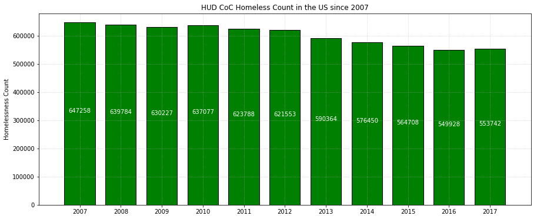


## HUD CoC Homeless Count for all States in the US in 2007 and 2017


```python
hud_change_df = hud_consol_df[hud_consol_df["Year"].isin([2007,2017])]
hud_change_group = hud_change_df.groupby(["Year","State"])["Total Homeless"].sum()
hud_df = pd.DataFrame(hud_change_group)
hud_df = hud_df.reset_index()
hud_df = hud_df.pivot(index='State', columns='Year', values='Total Homeless')
hud_df.head()
```


<div>
<style scoped>
    .dataframe tbody tr th:only-of-type {
        vertical-align: middle;
    }

    .dataframe tbody tr th {
        vertical-align: top;
    }

    .dataframe thead th {
        text-align: right;
    }
</style>
<table border="1" class="dataframe">
  <thead>
    <tr style="text-align: right;">
      <th>Year</th>
      <th>2007</th>
      <th>2017</th>
    </tr>
    <tr>
      <th>State</th>
      <th></th>
      <th></th>
    </tr>
  </thead>
  <tbody>
    <tr>
      <th>AK</th>
      <td>1642.0</td>
      <td>1845.0</td>
    </tr>
    <tr>
      <th>AL</th>
      <td>5452.0</td>
      <td>3793.0</td>
    </tr>
    <tr>
      <th>AR</th>
      <td>3836.0</td>
      <td>2467.0</td>
    </tr>
    <tr>
      <th>AZ</th>
      <td>14646.0</td>
      <td>8947.0</td>
    </tr>
    <tr>
      <th>CA</th>
      <td>138986.0</td>
      <td>134278.0</td>
    </tr>
  </tbody>
</table>
</div>


```python
# Homelessness Change Summary
ind = np.arange(len(hud_df[2007]))  # the x locations for the groups
width = 0.4  # the width of the bars

fig, ax = plt.subplots(figsize=(18,7))
rects1 = ax.bar(ind - width/2, hud_df[2007], width, color='SkyBlue', label='2007')
rects2 = ax.bar(ind + width/2, hud_df[2017], width, color='Pink', label='2017')

# Add some text for labels, title and custom x-axis tick labels, etc.
ax.set_ylabel('Homelessness Count')
ax.set_title('HUD CoC Homeless Count for all States in the US in 2007 and 2017')
ax.set_xticks(ind)
ax.set_xticklabels((hud_df.index),rotation=45)
ax.legend()

# Save the figure
plt.savefig("Homelessness_Change_Summary.png")

# Show graph
plt.show()
```


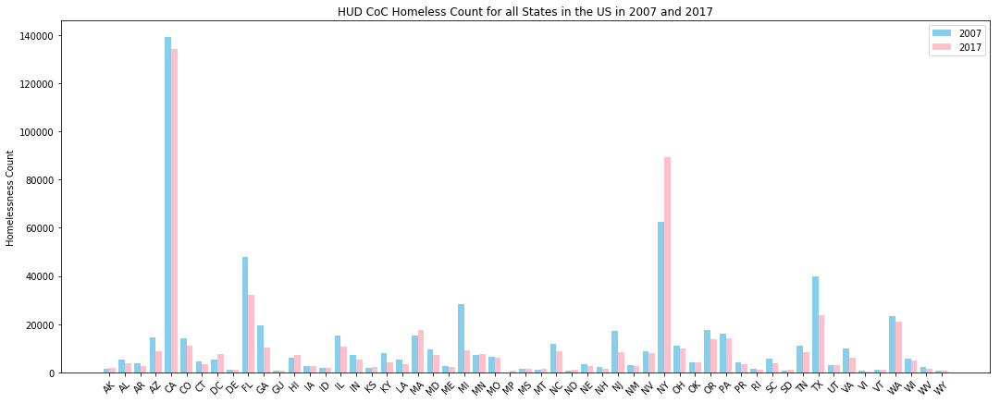


## Merge HUD and Zillow Data


```python
hud_cities_data = hud_city_df[hud_city_df.CityState != "Washington, WA"]
hud_cities_data = hud_cities_data[[ 'Year','CityState', 'Total Homeless']]
hud_cities_data['CityStateYear'] = hud_cities_data[['CityState','Year']].apply(lambda x: ' '.join(x.astype(str)), axis=1)
hud_cities_data = hud_cities_data.set_index(['Year'])
hud_cities_data.head()
```


<div>
<style scoped>
    .dataframe tbody tr th:only-of-type {
        vertical-align: middle;
    }

    .dataframe tbody tr th {
        vertical-align: top;
    }

    .dataframe thead th {
        text-align: right;
    }
</style>
<table border="1" class="dataframe">
  <thead>
    <tr style="text-align: right;">
      <th></th>
      <th>CityState</th>
      <th>Total Homeless</th>
      <th>CityStateYear</th>
    </tr>
    <tr>
      <th>Year</th>
      <th></th>
      <th></th>
      <th></th>
    </tr>
  </thead>
  <tbody>
    <tr>
      <th>2007</th>
      <td>Anchorage, AK</td>
      <td>974</td>
      <td>Anchorage, AK 2007</td>
    </tr>
    <tr>
      <th>2008</th>
      <td>Anchorage, AK</td>
      <td>1023</td>
      <td>Anchorage, AK 2008</td>
    </tr>
    <tr>
      <th>2009</th>
      <td>Anchorage, AK</td>
      <td>1267</td>
      <td>Anchorage, AK 2009</td>
    </tr>
    <tr>
      <th>2010</th>
      <td>Anchorage, AK</td>
      <td>1231</td>
      <td>Anchorage, AK 2010</td>
    </tr>
    <tr>
      <th>2011</th>
      <td>Anchorage, AK</td>
      <td>1223</td>
      <td>Anchorage, AK 2011</td>
    </tr>
  </tbody>
</table>
</div>


```python
# zillow_df = zillow_df.fillna(0)
zillow_df = zillow_df[['CityState','Year','ZHVIPerSqft_AllHomes', "ZHVI_AllHomes", "MedianSoldPricePerSqft_AllHomes"]]
zillow_df['Year'] = zillow_df['Year'].astype(str)
zillow_df['CityStateYear'] = zillow_df[['CityState','Year']].apply(lambda x: ' '.join(x.astype(str)), axis=1)
zillow_df.head()
```


<div>
<style scoped>
    .dataframe tbody tr th:only-of-type {
        vertical-align: middle;
    }

    .dataframe tbody tr th {
        vertical-align: top;
    }

    .dataframe thead th {
        text-align: right;
    }
</style>
<table border="1" class="dataframe">
  <thead>
    <tr style="text-align: right;">
      <th></th>
      <th>CityState</th>
      <th>Year</th>
      <th>ZHVIPerSqft_AllHomes</th>
      <th>ZHVI_AllHomes</th>
      <th>MedianSoldPricePerSqft_AllHomes</th>
      <th>CityStateYear</th>
    </tr>
  </thead>
  <tbody>
    <tr>
      <th>0</th>
      <td>Anchorage, AK</td>
      <td>2007</td>
      <td>201.333333</td>
      <td>300758.333333</td>
      <td>NaN</td>
      <td>Anchorage, AK 2007</td>
    </tr>
    <tr>
      <th>1</th>
      <td>Anchorage, AK</td>
      <td>2008</td>
      <td>199.500000</td>
      <td>296191.666667</td>
      <td>NaN</td>
      <td>Anchorage, AK 2008</td>
    </tr>
    <tr>
      <th>2</th>
      <td>Anchorage, AK</td>
      <td>2009</td>
      <td>185.416667</td>
      <td>272291.666667</td>
      <td>NaN</td>
      <td>Anchorage, AK 2009</td>
    </tr>
    <tr>
      <th>3</th>
      <td>Anchorage, AK</td>
      <td>2010</td>
      <td>175.333333</td>
      <td>259766.666667</td>
      <td>NaN</td>
      <td>Anchorage, AK 2010</td>
    </tr>
    <tr>
      <th>4</th>
      <td>Anchorage, AK</td>
      <td>2011</td>
      <td>173.500000</td>
      <td>260233.333333</td>
      <td>NaN</td>
      <td>Anchorage, AK 2011</td>
    </tr>
  </tbody>
</table>
</div>


```python
hud_zillow_df = hud_cities_data.merge(zillow_df, on='CityStateYear', how='outer')
hud_zillow_df.head()
```


<div>
<style scoped>
    .dataframe tbody tr th:only-of-type {
        vertical-align: middle;
    }

    .dataframe tbody tr th {
        vertical-align: top;
    }

    .dataframe thead th {
        text-align: right;
    }
</style>
<table border="1" class="dataframe">
  <thead>
    <tr style="text-align: right;">
      <th></th>
      <th>CityState_x</th>
      <th>Total Homeless</th>
      <th>CityStateYear</th>
      <th>CityState_y</th>
      <th>Year</th>
      <th>ZHVIPerSqft_AllHomes</th>
      <th>ZHVI_AllHomes</th>
      <th>MedianSoldPricePerSqft_AllHomes</th>
    </tr>
  </thead>
  <tbody>
    <tr>
      <th>0</th>
      <td>Anchorage, AK</td>
      <td>974.0</td>
      <td>Anchorage, AK 2007</td>
      <td>Anchorage, AK</td>
      <td>2007</td>
      <td>201.333333</td>
      <td>300758.333333</td>
      <td>NaN</td>
    </tr>
    <tr>
      <th>1</th>
      <td>Anchorage, AK</td>
      <td>1023.0</td>
      <td>Anchorage, AK 2008</td>
      <td>Anchorage, AK</td>
      <td>2008</td>
      <td>199.500000</td>
      <td>296191.666667</td>
      <td>NaN</td>
    </tr>
    <tr>
      <th>2</th>
      <td>Anchorage, AK</td>
      <td>1267.0</td>
      <td>Anchorage, AK 2009</td>
      <td>Anchorage, AK</td>
      <td>2009</td>
      <td>185.416667</td>
      <td>272291.666667</td>
      <td>NaN</td>
    </tr>
    <tr>
      <th>3</th>
      <td>Anchorage, AK</td>
      <td>1231.0</td>
      <td>Anchorage, AK 2010</td>
      <td>Anchorage, AK</td>
      <td>2010</td>
      <td>175.333333</td>
      <td>259766.666667</td>
      <td>NaN</td>
    </tr>
    <tr>
      <th>4</th>
      <td>Anchorage, AK</td>
      <td>1223.0</td>
      <td>Anchorage, AK 2011</td>
      <td>Anchorage, AK</td>
      <td>2011</td>
      <td>173.500000</td>
      <td>260233.333333</td>
      <td>NaN</td>
    </tr>
  </tbody>
</table>
</div>


## Estimated Median Home Value vs. Homeless Counts


```python
# Estimated Median House Price
fig = plt.figure(figsize=(8,5)) 

plt.scatter(hud_zillow_df["ZHVI_AllHomes"], 
            hud_zillow_df["Total Homeless"],
            color="red", marker="o", 
            alpha=0.8)

# Incorporate the other graph properties
plt.title("Estimated Median Home Value vs. Homeless Counts")
plt.ylabel("Homeless count")
plt.xlabel("Estimated Median House Price (in $)") 
plt.grid(True) 

plt.savefig("ZHVIPerSqft_AllHomes_HomelessCount.png")
plt.show()
```


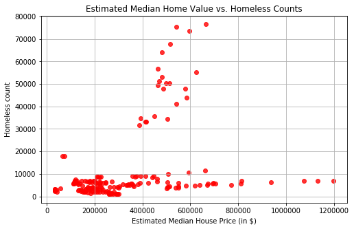


## Estimated Median Home Value per Sqft. vs. Homeless Counts


```python
#Scatterplot for real estate prices vs. homeless counts for 18 major cities for data 
#collected for the past 10 years! 

fig = plt.figure(figsize=(8,5)) 

plt.scatter(hud_zillow_df["ZHVIPerSqft_AllHomes"], 
            hud_zillow_df["Total Homeless"],
            color="black", marker="o", 
            alpha=0.8)

# Incorporate the other graph properties
plt.title("Estimated Median Home Value per Sqft. vs. Homeless Counts")
plt.ylabel("Homeless count")
plt.xlabel("Estimated Median House Price per square ft (in $)")
plt.grid(True) 

plt.savefig("ZHVIPerSqft_AllHomes_HomelessCount.png")
plt.show()
```


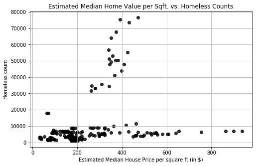


## Correlation between Median Home Value and Estimated Home Value (ZHVI) Per Sqft


```python
#Scatterplot ZHVIPerSqft_AllHomes data vs MedianSoldPricePerSqft_AllHomes to make 
#sure that ZHVI estimates can be used as representative of actual sales prices.
#ZHVI is available for all cities, without gaps (NaNs) so that's why we chose to use it,
#instead of actual sold price data.

fig = plt.figure(figsize=(8,5)) 
x = hud_zillow_df["MedianSoldPricePerSqft_AllHomes"] 
y = hud_zillow_df["ZHVIPerSqft_AllHomes"] 
plt.scatter(x, y, color="purple", marker="o", alpha=0.8) 

#Calculate and add R2 value
mask = ~np.isnan(x) & ~np.isnan(y)
slope, intercept, r_value, p_value, std_err = stats.linregress(x[mask],y[mask])
R= round(r_value**2, 4)

#Add regression line
sns.regplot(hud_zillow_df["MedianSoldPricePerSqft_AllHomes"], 
              hud_zillow_df["ZHVIPerSqft_AllHomes"], label = "$R^2$= " + str(R))

# Incorporate the other graph properties
plt.title("Correlation between Median Home Value and Estimated Home Value (ZHVI) Per Sqft")
plt.ylabel("Estimated Home Value Per Sqft (in $)")
plt.xlabel("Median Home Value Per Sqft (in $)") 

plt.legend(loc='best')
plt.grid(True)
# sns.set_style('whitegrid')
plt.show()

```


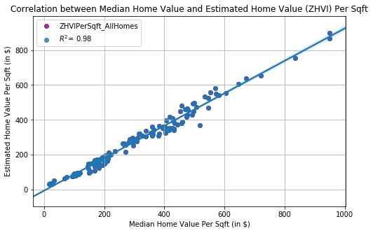


## Housing Price vs. Homelessness


```python
sfo_df = hud_zillow_df[hud_zillow_df.CityState_x == "San Francisco, CA"]

#ax = selected_new_df[['Year', 'ZHVIPerSqft_AllHomes']].plot(x='Year', linestyle='-', marker='o')
#selected_new_df[['Year', 'Total Homeless']].plot(x='Year', kind='bar', ax=ax)

fig, ax = plt.subplots()

ax2 = ax.twinx()

ax.bar(sfo_df['Year'], sfo_df["Total Homeless"], color=(190/255,190/255,190/255,0.7), label='Total Homeless')

ax2.plot(sfo_df['Year'], sfo_df["ZHVIPerSqft_AllHomes"], color='green', label='ZHVIPerSqft_AllHomes')
plt.title("San Francisco, CA Housing Price vs. Homelessness")
plt.ylim(0, sfo_df['ZHVIPerSqft_AllHomes'].max()+100)
ax.set_xticklabels(sfo_df['Year'])
plt.xlabel("Year")
plt.grid(False)
ax2.legend(loc='best')

plt.show()
```


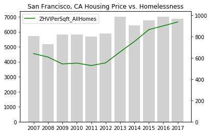


```python
LA_df = hud_zillow_df[hud_zillow_df.CityState_x == "Los Angeles, CA"]

#ax = selected_new_df[['Year', 'ZHVIPerSqft_AllHomes']].plot(x='Year', linestyle='-', marker='o')
#selected_new_df[['Year', 'Total Homeless']].plot(x='Year', kind='bar', ax=ax)

fig, ax = plt.subplots()

ax2 = ax.twinx()

ax.bar(LA_df['Year'], LA_df["Total Homeless"], color=(190/255,190/255,190/255,0.7), label='Total Homeless')

ax2.plot(LA_df['Year'], LA_df["ZHVIPerSqft_AllHomes"], color='green', label='ZHVIPerSqft_AllHomes')
plt.ylim(0, LA_df['ZHVIPerSqft_AllHomes'].max()+100)
plt.title("Los Angeles, CA Housing Price vs. Homelessness")
ax.set_xticklabels(LA_df['Year'])

#ax.legend(loc='best')
ax2.legend(loc='best')

plt.show()
```


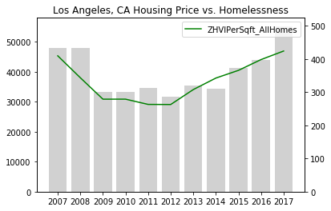


```python
NY_df = hud_zillow_df[hud_zillow_df.CityState_x == "New York, NY"]

#ax = selected_new_df[['Year', 'ZHVIPerSqft_AllHomes']].plot(x='Year', linestyle='-', marker='o')
#selected_new_df[['Year', 'Total Homeless']].plot(x='Year', kind='bar', ax=ax)

fig, ax = plt.subplots()

ax2 = ax.twinx()

ax.bar(NY_df['Year'], NY_df["Total Homeless"], color=(190/255,190/255,190/255,0.7), label='Total Homeless')

ax2.plot(NY_df['Year'], NY_df["ZHVIPerSqft_AllHomes"], color='green', label='ZHVIPerSqft_AllHomes')
plt.ylim(0, NY_df['ZHVIPerSqft_AllHomes'].max()+100)
ax.set_xticklabels(NY_df['Year'])
plt.title("New York, NY Housing Price vs. Homelessness")
#ax.legend(loc='best')
ax2.legend(loc='best')

plt.show()
```


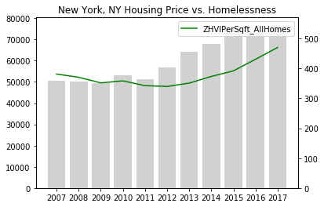


```python
FL_df = hud_zillow_df[hud_zillow_df.CityState_x == "Miami, FL"]

#ax = selected_new_df[['Year', 'ZHVIPerSqft_AllHomes']].plot(x='Year', linestyle='-', marker='o')
#selected_new_df[['Year', 'Total Homeless']].plot(x='Year', kind='bar', ax=ax)

fig, ax = plt.subplots()

ax2 = ax.twinx()

ax.bar(FL_df['Year'], FL_df["Total Homeless"], color=(190/255,190/255,190/255,0.7), label='Total Homeless')

ax2.plot(FL_df['Year'], FL_df["ZHVIPerSqft_AllHomes"], color='green', label='ZHVIPerSqft_AllHomes')
plt.ylim(0, FL_df['ZHVIPerSqft_AllHomes'].max()+100)
ax.set_xticklabels(FL_df['Year'])
plt.title("Miami, FL Housing Price vs. Homelessness")
#ax.legend(loc='best')
ax2.legend(loc='best')

plt.show()
```


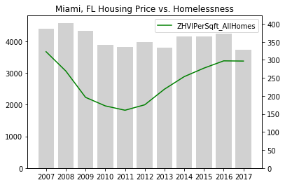


## Homeless Demographics Summary by Gender


```python
# Homeless Demographics Summary by Gender and Race
# read file
file_path4 = os.path.join('HUD_Demographics_Data.xlsx')
hud_demo_df = pd.read_excel(file_path4, sheet_name="Gender")
hud_demo_df.head()
```


<div>
<style scoped>
    .dataframe tbody tr th:only-of-type {
        vertical-align: middle;
    }

    .dataframe tbody tr th {
        vertical-align: top;
    }

    .dataframe thead th {
        text-align: right;
    }
</style>
<table border="1" class="dataframe">
  <thead>
    <tr style="text-align: right;">
      <th></th>
      <th>Year</th>
      <th>State</th>
      <th>Gender</th>
      <th>Energency Shelter</th>
      <th>Transitional Housing</th>
      <th>Unsheltered</th>
      <th>Total</th>
    </tr>
  </thead>
  <tbody>
    <tr>
      <th>0</th>
      <td>2017</td>
      <td>NY</td>
      <td>Female</td>
      <td>39490</td>
      <td>2064</td>
      <td>974</td>
      <td>42528</td>
    </tr>
    <tr>
      <th>1</th>
      <td>2017</td>
      <td>NY</td>
      <td>Male</td>
      <td>39451</td>
      <td>3640</td>
      <td>3552</td>
      <td>46643</td>
    </tr>
    <tr>
      <th>2</th>
      <td>2017</td>
      <td>NY</td>
      <td>Transgender</td>
      <td>198</td>
      <td>94</td>
      <td>29</td>
      <td>321</td>
    </tr>
    <tr>
      <th>3</th>
      <td>2017</td>
      <td>NY</td>
      <td>Do not identify as Female, Male, or Transgender</td>
      <td>10</td>
      <td>1</td>
      <td>0</td>
      <td>11</td>
    </tr>
    <tr>
      <th>4</th>
      <td>2017</td>
      <td>CA</td>
      <td>Female</td>
      <td>11600</td>
      <td>6787</td>
      <td>25097</td>
      <td>43484</td>
    </tr>
  </tbody>
</table>
</div>


```python
# Pie Charts - Demographics Summary by Gender - New York
# Set the labels 
labels = ["Do not Identify","Female","Male","TG"]
# by Gender
hud_demo_ny = hud_demo_df[hud_demo_df.State == 'NY']
hud_demo_ny_group = hud_demo_ny.groupby("Gender")["Total"].sum()
# Calculate Total Homeless
homeless_total = hud_demo_ny["Total"].sum()
# Calculate Percentage
homeless_percentage = round(((hud_demo_ny_group/homeless_total)*100),2)
sizes = homeless_percentage
explode = (0.1, 0 , 0, 0)  
# Plot Pie Chart
fig1, ax1 = plt.subplots(figsize=(5,5))
ax1.pie(sizes, explode=explode, labels=labels, autopct='%1.1f%%',shadow=True, startangle=90)
ax1.axis('equal')  # Equal aspect ratio ensures that pie is drawn as a circle.
plt.title("Homeless Demographic Summary by Gender - New York")
# Show Plot
plt.show()

```


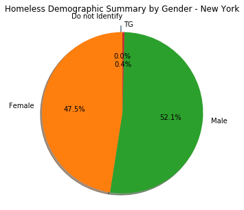


```python
# California
hud_demo_ca = hud_demo_df[hud_demo_df.State == 'CA']
hud_demo_ca_group = hud_demo_ca.groupby("Gender")["Total"].sum()
# Calculate Total Homeless
homeless_total = hud_demo_ca["Total"].sum()
# Calculate Percentage
homeless_percentage = round(((hud_demo_ca_group/homeless_total)*100),2)
sizes = homeless_percentage
explode = (0.1, 0 , 0, 0)  
# Plot Pie Chart
fig1, ax1 = plt.subplots(figsize=(5,5))
ax1.pie(sizes, explode=explode, labels=labels, autopct='%1.1f%%',shadow=True, startangle=90)
ax1.axis('equal')  # Equal aspect ratio ensures that pie is drawn as a circle.
plt.title("Homeless Demographic Summary by Gender - California")
# Show Plot
plt.show()
```


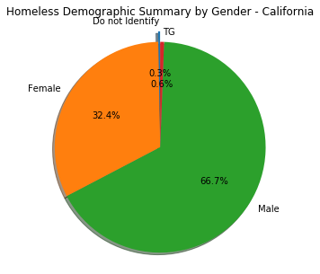


```python
# Florida
hud_demo_fl = hud_demo_df[hud_demo_df.State == 'FL']
hud_demo_fl_group = hud_demo_fl.groupby("Gender")["Total"].sum()
# Calculate Total Homeless
homeless_total = hud_demo_fl["Total"].sum()
# Calculate Percentage
homeless_percentage = round(((hud_demo_fl_group/homeless_total)*100),2)
sizes = homeless_percentage
explode = (0.1, 0 , 0, 0)  
# Plot Pie Chart
fig1, ax1 = plt.subplots(figsize=(5,5))
ax1.pie(sizes, explode=explode, labels=labels, autopct='%1.1f%%',shadow=True, startangle=90)
ax1.axis('equal')  # Equal aspect ratio ensures that pie is drawn as a circle.
plt.title("Homeless Demographic Summary by Gender - Florida")
# Show Plot
plt.show()
```


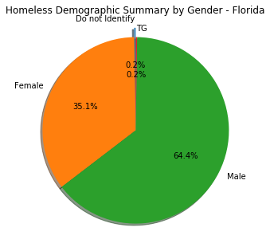


## Homeless Demographics Summary by Race


```python
# Demographic Summary by Race
hud_demo_race_df = pd.read_excel(file_path4, sheet_name="Race")
hud_demo_race_df.head()
```


<div>
<style scoped>
    .dataframe tbody tr th:only-of-type {
        vertical-align: middle;
    }

    .dataframe tbody tr th {
        vertical-align: top;
    }

    .dataframe thead th {
        text-align: right;
    }
</style>
<table border="1" class="dataframe">
  <thead>
    <tr style="text-align: right;">
      <th></th>
      <th>Year</th>
      <th>State</th>
      <th>Race</th>
      <th>Energency Shelter</th>
      <th>Transitional Housing</th>
      <th>Unsheltered</th>
      <th>Total</th>
    </tr>
  </thead>
  <tbody>
    <tr>
      <th>0</th>
      <td>2017</td>
      <td>NY</td>
      <td>Black or African-American</td>
      <td>55799</td>
      <td>3363</td>
      <td>2301</td>
      <td>61463</td>
    </tr>
    <tr>
      <th>1</th>
      <td>2017</td>
      <td>NY</td>
      <td>White</td>
      <td>15855</td>
      <td>2039</td>
      <td>2000</td>
      <td>19894</td>
    </tr>
    <tr>
      <th>2</th>
      <td>2017</td>
      <td>NY</td>
      <td>Asian</td>
      <td>884</td>
      <td>46</td>
      <td>126</td>
      <td>1056</td>
    </tr>
    <tr>
      <th>3</th>
      <td>2017</td>
      <td>NY</td>
      <td>American Indian or Alaska Native</td>
      <td>664</td>
      <td>30</td>
      <td>35</td>
      <td>729</td>
    </tr>
    <tr>
      <th>4</th>
      <td>2017</td>
      <td>NY</td>
      <td>Native Hawaiian or Other Pacific Islander</td>
      <td>1159</td>
      <td>19</td>
      <td>13</td>
      <td>1191</td>
    </tr>
  </tbody>
</table>
</div>


```python
# Pie Charts - New York
# Set the labels and colors of Pie
labels = ['American Indian or Alaska Native ', 'Asian ',
       'Black or African-American ', 'Multiple Races ',
       'Native Hawaiian or Other Pacific Islander ', 'White ']

# by Race
hud_demo_ny = hud_demo_race_df[hud_demo_race_df.State == 'NY']
hud_demo_ny_group = hud_demo_ny.groupby("Race")["Total"].sum()
# Calculate Total Homeless
homeless_total = hud_demo_race_df["Total"].sum()
# Calculate Percentage
homeless_percentage = round(((hud_demo_ny_group/homeless_total)*100),2)
sizes = homeless_percentage
explode = (0.1, 0 , 0, 0,0,0)  
# Plot Pie Chart
fig1, ax1 = plt.subplots(figsize=(5,5))
ax1.pie(sizes, explode=explode, labels=labels, autopct='%1.1f%%',shadow=True, startangle=90)
ax1.axis('equal')  # Equal aspect ratio ensures that pie is drawn as a circle.
plt.title("Homeless Demographic Summary - New York")
# Show Plot
plt.show()
```


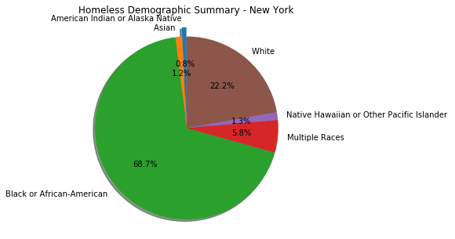


```python
# California
hud_demo_ca = hud_demo_race_df[hud_demo_race_df.State == 'CA']
hud_demo_ca_group = hud_demo_ca.groupby("Race")["Total"].sum()
# Calculate Total Homeless
homeless_total = hud_demo_race_df["Total"].sum()
# Calculate Percentage
homeless_percentage = round(((hud_demo_ca_group/homeless_total)*100),2)
sizes = homeless_percentage
explode = (0.1, 0 , 0, 0,0,0)  
# Plot Pie Chart
fig1, ax1 = plt.subplots(figsize=(5,5))
ax1.pie(sizes, explode=explode, labels=labels, autopct='%1.1f%%',shadow=True, startangle=90)
ax1.axis('equal')  # Equal aspect ratio ensures that pie is drawn as a circle.
plt.title("Homeless Demographic Summary - California")
# Show Plot
plt.show()
```


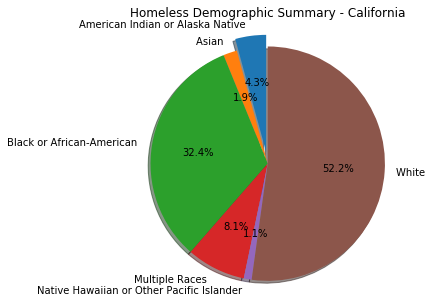


```python
# Florida
hud_demo_fl = hud_demo_race_df[hud_demo_race_df.State == 'FL']
hud_demo_fl_group = hud_demo_fl.groupby("Race")["Total"].sum()
# Calculate Total Homeless
homeless_total = hud_demo_race_df["Total"].sum()
# Calculate Percentage
homeless_percentage = round(((hud_demo_fl_group/homeless_total)*100),2)
sizes = homeless_percentage
explode = (0.1, 0 , 0, 0,0,0)  
# Plot Pie Chart
fig1, ax1 = plt.subplots(figsize=(5,5))
ax1.pie(sizes, explode=explode, labels=labels, autopct='%1.1f%%',shadow=True, startangle=90)
ax1.axis('equal')  # Equal aspect ratio ensures that pie is drawn as a circle.
plt.title("Homeless Demographic Summary - Florida")
# Show Plot
plt.show()

```


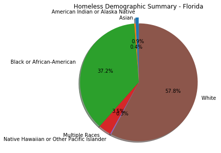

## Summary

1. A scatterplot of home prices versus homelessness for 18 major cities across the U.S., does not show a clear positive correlation between these two variables. The data does indicate a pocket with high homeless counts, in areas where estimated median home values are between ~400-700K.

2. A closer look at for four different cities (San Francisco, Los Angeles, New York and Miami) shows a positive correlation between these two variables from 2012 until 2017.

3. Homelessness in the U.S. decreased by 14% since 2007, based on HUD’s CoC (Continuum of Care) counts. 
Because one explanation is that there is a great deal of variation in the data in different parts of the country, however, many places continue to see reductions in homelessness. Thirty (30) states and the District of Columbia reported decreases in homelessness between 2016 and 2017. Challenges in some major metropolitan areas, however, have had a major impact on the national trend lines.

4. At the state level, homeless counts decrease between 2007 and 2017 for almost all states, with the exception of HI, DC, MA, NY.

5. Demographics Summary (By Gender)
* New York - almost equal proportion of males and females
* California and Florida - ~2:1 male to female ratio
